## Critério de priorização

A prioridade dos casos de teste foi definida considerando o impacto no fluxo principal da API, risco de segurança, possibilidade de corrupção de dados e relevância da regra de negócio.

- **Alta:** cenários que impactam autenticação, criação, consulta, atualização ou exclusão de reservas, além de regras críticas como datas inválidas, preço negativo, campos essenciais e segurança.
- **Média:** cenários importantes de validação, filtros, entradas inválidas e variações de campos obrigatórios que não bloqueiam diretamente o fluxo principal.
- **Baixa:** cenários complementares ou de menor impacto para o funcionamento principal da API.

## LOGIN
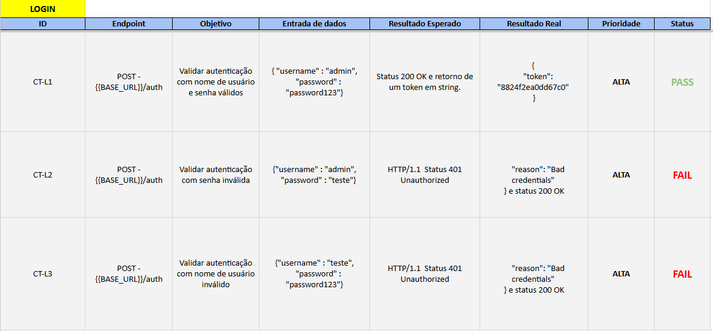

##
## NEW RESERVATION

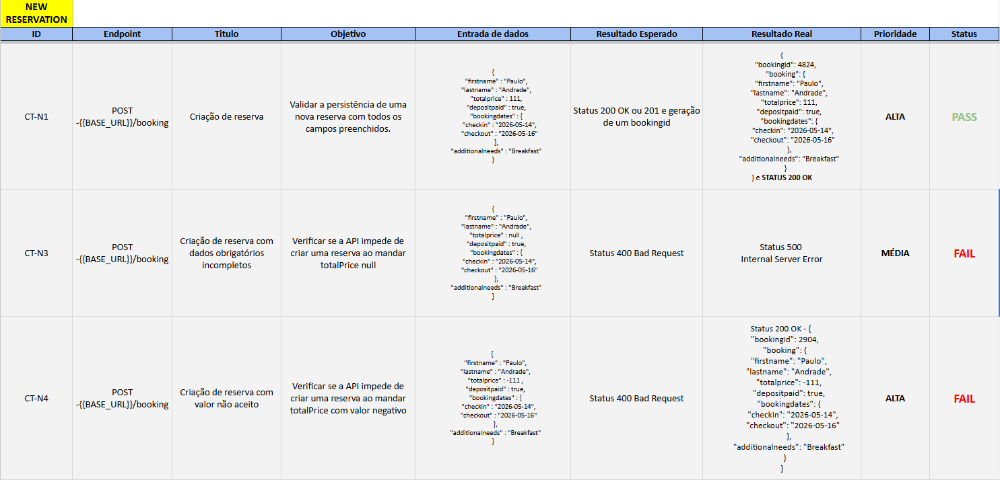
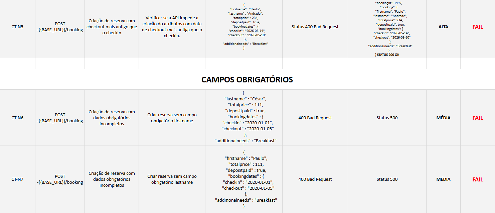
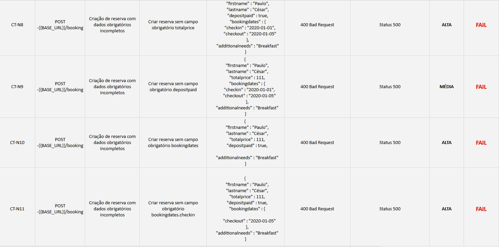
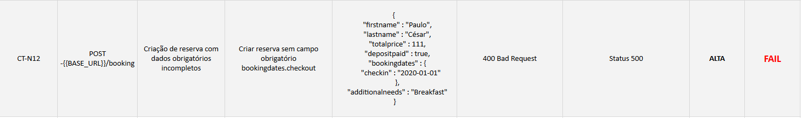

##
## FIND BOOKING

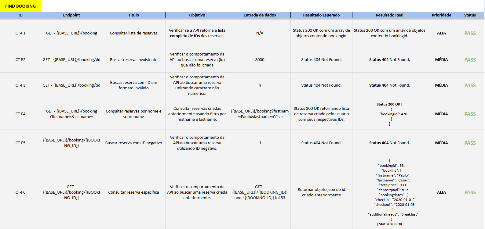
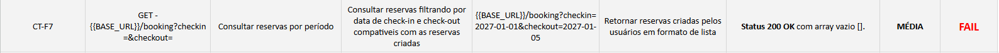

##
## EDIT BOOKING

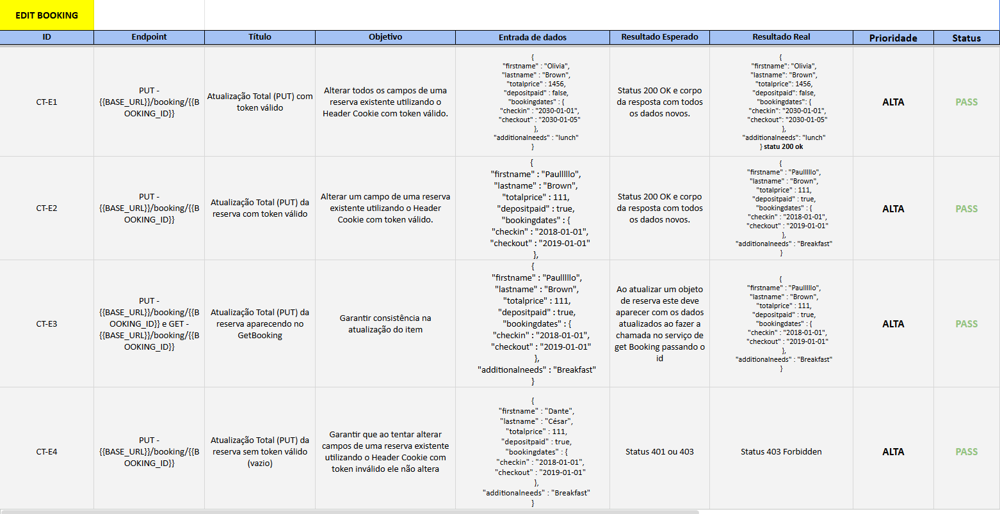
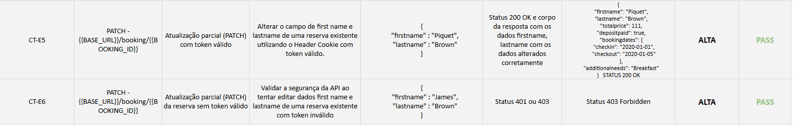
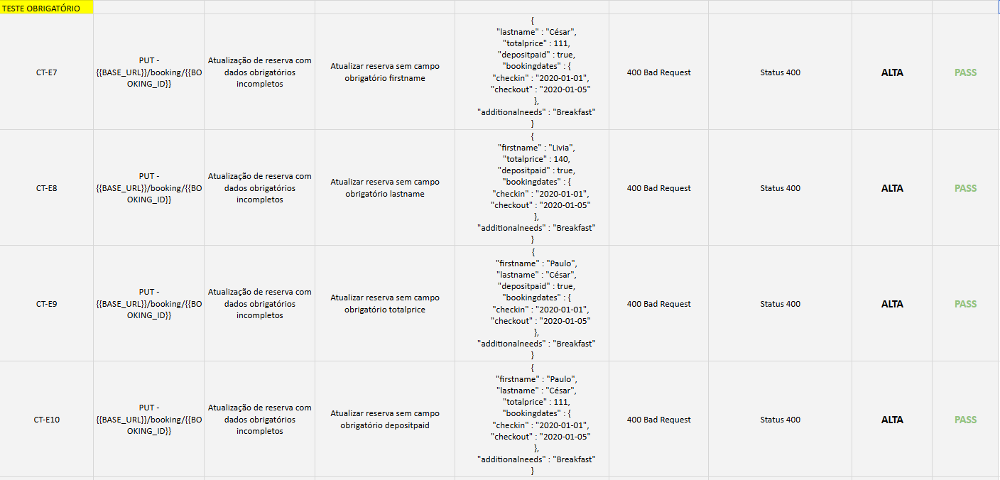
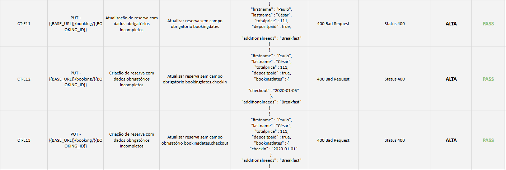
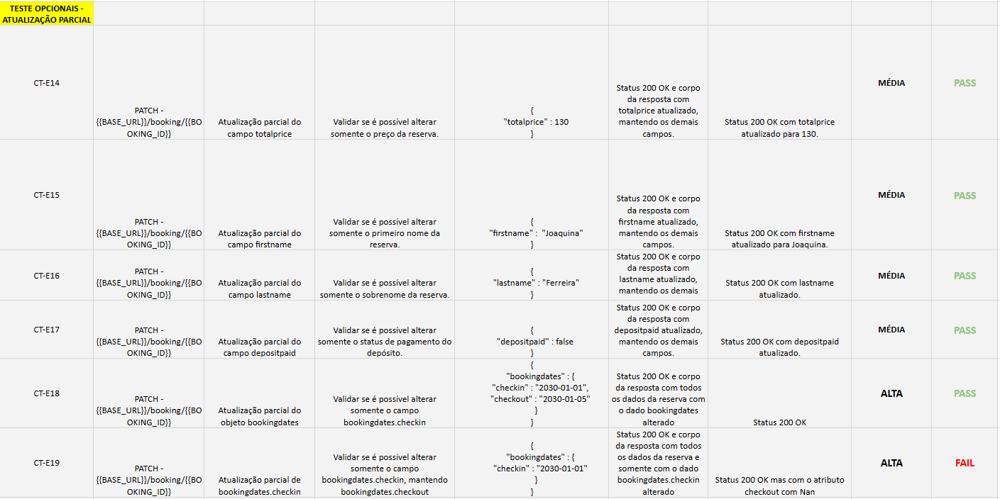
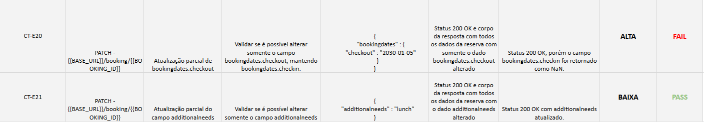

##
## DELETE BOOKING

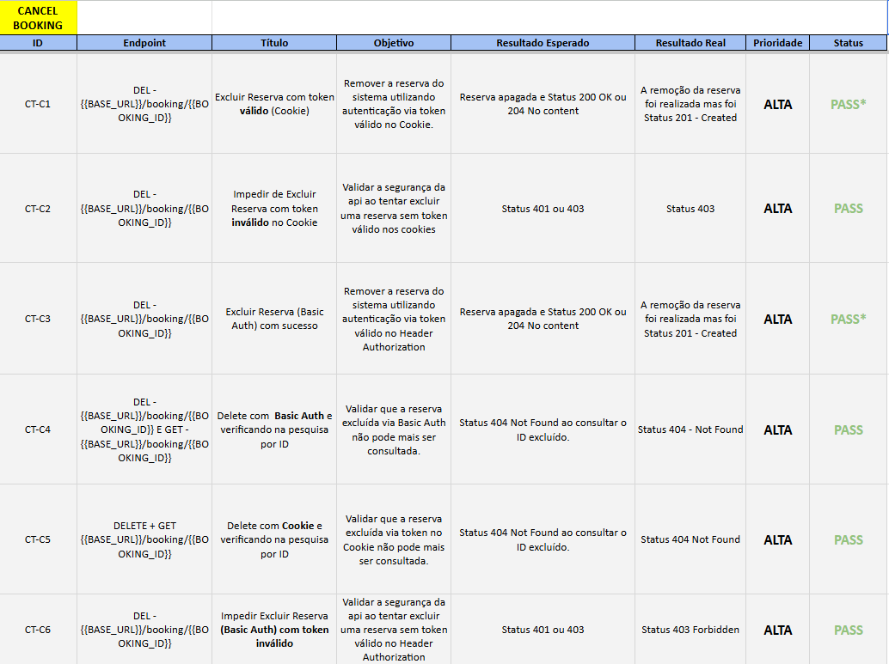

